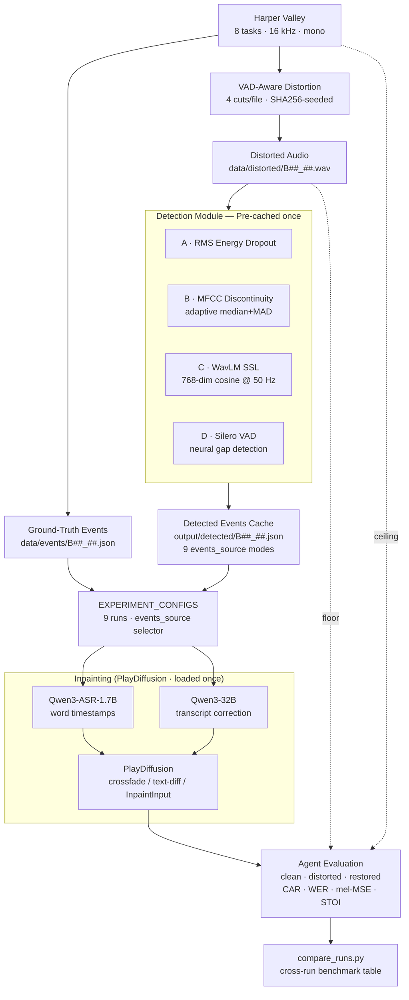

# Telephony Speech Restoration — v5.0

**Hypothesis:** Blind audio inpainting of telephony packet-loss dropouts measurably improves a banking-task agent's correct-action rate (CAR) compared to unrestored audio.

---

## Pipeline



---

## Three-Condition Evaluation

| Condition | Source | Role |
|-----------|--------|------|
| **clean** | Original Harper Valley caller audio | Ceiling |
| **distorted** | Telephony-degraded (band-limit, noise, dropouts) | Floor |
| **restored** | Inpainted output of the Colab notebook | System under test |

**Metrics:** CAR (correct-action rate), WER, mel-MSE lift, STOI lift.

---

## Detection Methods

| ID | Method | Type | Catches |
|----|--------|------|---------|
| A | RMS Energy Dropout | Signal | Hard silence insertions |
| B | MFCC Discontinuity (adaptive) | Signal | Spectral jumps |
| C | WavLM Frame Embeddings | Neural SSL | Phoneme-level content loss |
| D | Silero VAD | Neural VAD | Comfort-noise fills, short gaps |

Nine `events_source` modes are swept: `gt`, `rms`, `mfcc`, `wavlm`, `silero`, `both`, `wavlm+rms`, `wavlm+silero`, `any`.

---

## Repository Structure

```
telephony-speech-restoration/
├── notebooks/
│   ├── AudioInpainting_v5_0.ipynb   ← canonical notebook (run in Colab)
│   ├── AudioInpainting_v4_0.ipynb   ← reference
│   └── AudioInpainting_v3_0.ipynb   ← reference
├── data/
│   ├── clean/                       ← 16 kHz mono caller WAVs (not committed)
│   ├── distorted/                   ← telephony-degraded counterparts (40 files)
│   ├── events/                      ← ground-truth cut JSON files (40 files)
│   └── raw/harper-valley/           ← Harper Valley clone (not committed)
├── evals/
│   ├── eval_runner.py               ← CAR + WER scoring (clean/distorted/restored)
│   ├── compare_runs.py              ← cross-run benchmark table
│   └── eval_cuts_detector.py        ← standalone detection benchmark (125 clips)
├── scripts/
│   ├── prepare_harper_valley.py     ← build data/clean/ from Harper Valley
│   ├── generate_distorted_audio.py  ← build data/distorted/ from data/clean/
│   ├── detect_cuts.py               ← CLI silence + spectral-flux detector
│   └── stackai_client.py            ← StackAI REST client helper
├── docs/
│   ├── pipeline_overview.tex        ← LaTeX write-up
│   └── pipeline_overview.pdf        ← compiled PDF
├── results/                         ← eval CSVs and summary JSONs (gitignored)
└── sandbox/
    └── actions.md                   ← 8 banking action definitions
```

---

## Dataset

**[Gridspace Stanford Harper Valley](https://github.com/cricketclub/gridspace-stanford-harper-valley)** — real telephony conversations for 8 banking actions at 16 kHz mono.

```bash
git clone https://github.com/cricketclub/gridspace-stanford-harper-valley data/raw/harper-valley

python scripts/prepare_harper_valley.py \
    --source data/raw/harper-valley \
    --max-per-task 5
```

---

## Common Commands

```bash
# Generate distorted counterparts from data/clean/
python scripts/generate_distorted_audio.py

# Run the restoration notebook in Google Colab (T4 GPU)
# Upload data/distorted/ + data/events/ to Drive → run AudioInpainting_v5_0.ipynb

# Score one pipeline version
python evals/eval_runner.py \
    --conditions clean distorted restored \
    --restored-dir data/restored_wavlm_silero/ \
    --label wavlm_silero \
    --output results/

# Compare multiple runs side-by-side
python evals/compare_runs.py results/summary_*.json
```

---

## Notebook Workflow (Colab)

1. Upload `data/distorted/B##_##.wav` + `data/events/B##_##.json` to Drive `preprocessed/`
2. Open `AudioInpainting_v5_0.ipynb` → **Runtime → Run All**
3. **Step 7a** — Detection benchmark: all 4 methods vs ground truth, no inpainting
4. **Step 9** — Pre-detection: runs all detectors once, caches to `output/detected/`
5. **Step 10** — Experiment loop: 9 configs × 40 files, saves per-run JSON reports
6. Download outputs, run `eval_runner.py` per run tag, then `compare_runs.py`

---

## Banking Actions

| ID | Harper Valley `task_type` | Label |
|----|--------------------------|-------|
| B01 | replace card | `replace_card` |
| B02 | transfer money | `transfer_money` |
| B03 | check balance | `check_balance` |
| B04 | order checks | `order_checks` |
| B05 | pay bill | `pay_bill` |
| B06 | reset password | `reset_password` |
| B07 | schedule appointment | `schedule_appointment` |
| B08 | get branch hours | `get_branch_hours` |

Filenames: `<action_id>_<n>.wav` (e.g. `B03_05.wav`).
